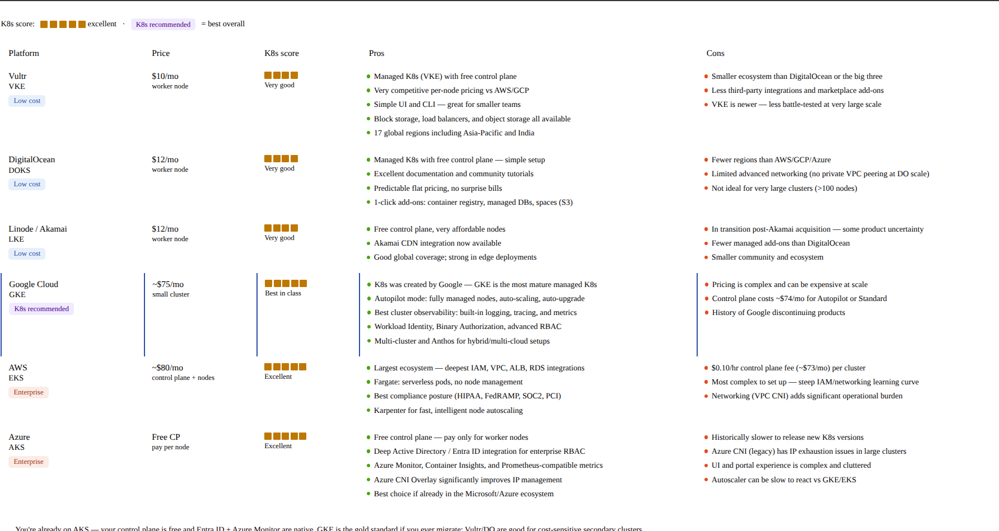
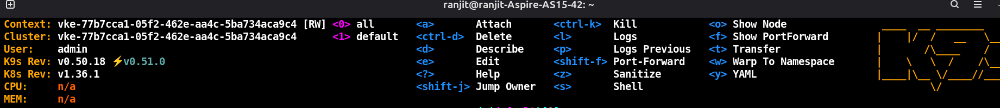

# 11-6-26
#tasks

1. [x] **understanding how to deploy extension on chrome web store**

<br>

2. [x] **all hosting platfrom price tabel**


**IMP**
###### Running 2 different cluster
```
# Backup first
cp ~/.kube/config ~/.kube/config.bak

# Merge
KUBECONFIG=~/.kube/config:~/Downloads/vke-kubeconfig.yaml \
  kubectl config view --flatten > /tmp/merged.yaml

mv /tmp/merged.yaml ~/.kube/config
chmod 600 ~/.kube/config
```

###### Switch context
```
# See all contexts (find your VKE context name)
kubectl config get-contexts

# Switch to VKE
kubectl config use-context vke-xxxxxxxx

# Test
kubectl get nodes

# Launch k9s — picks up active context automatically
k9s
```

3. [x] **configure k8s on vulter and adder kubeconfig in kubectl and k9s**



```
1. Incident detected — data lost or corrupted
2. Scale down app deployments (prevent new writes)
   kubectl scale deployment <app> --replicas=0
3. Identify which backup to restore
   aws s3 ls s3://bucket/ --endpoint-url ... | sort
4. Run restore pod (Scenario C above)
5. Verify row counts / spot-check data
   psql -c "SELECT COUNT(*) FROM orders;"
6. Scale app back up
   kubectl scale deployment <app> --replicas=3
7. Monitor logs for 10 minutes
```