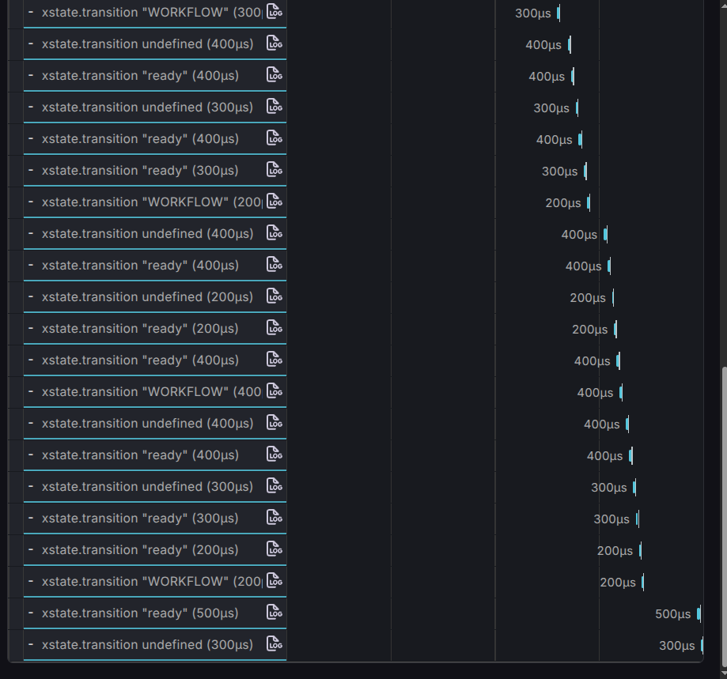

## 13-04-2026


implemented tracing in state chages 
```
import { buildEffectRootComponent } from "@de-workflow/xstate/tree";
import { StrictMode } from "react";
import { createRoot } from "react-dom/client";
import { createActor } from "xstate";

import { history, routes } from "#lib/routing.ts";
import { bootstrapClient } from "./rootMachine.tsx";

import "./routes/styles.css";
import { ConfigProvider, Effect, Layer, ManagedRuntime } from "effect";
import {OtelLayer} from '@de-workflow/opentelemetry/client'

if (history.location.pathname === "/" || history.location.pathname === "") {
  history.replace("/chat");
}
const otelRuntime = ManagedRuntime.make(
  Layer.provide(
    OtelLayer("state"),
    ConfigProvider.layer(
      ConfigProvider.fromUnknown({
        VITE_OTEL_URL: import.meta.env['VITE_OTEL_URL']
      })
    )
  )
);

const rootMachine = await bootstrapClient();

const actor = createActor(rootMachine, {
  input: undefined,
  inspect: (inspectionEvent) => {
    if (inspectionEvent.type === "@xstate.snapshot") {
      const stateValue = JSON.stringify(inspectionEvent.snapshot.value);
      const eventType = inspectionEvent.snapshot.event?.type ?? "init";

      
      
       const traceProgram = Effect.withSpan("xstate.transition", {                                                      
        attributes: {
          "state.value": stateValue,
          "event.type": eventType,
          "actor.id": inspectionEvent.actorRef.id,
        },
      })(Effect.void);

   
      otelRuntime.runPromise(traceProgram)
    }
  },
}).start();

const App = buildEffectRootComponent({
  actor,
  routing: {
    routes: [...routes],
    history,
    basePath: "/",
  },
});

// biome-ignore lint/style/noNonNullAssertion: root
createRoot(document.getElementById("root")!).render(
  <StrictMode>
    <div className="flex h-dvh w-dvw flex-col">
      <App />
    </div>
  </StrictMode>,
);
```
Added parent span for all the state changes
