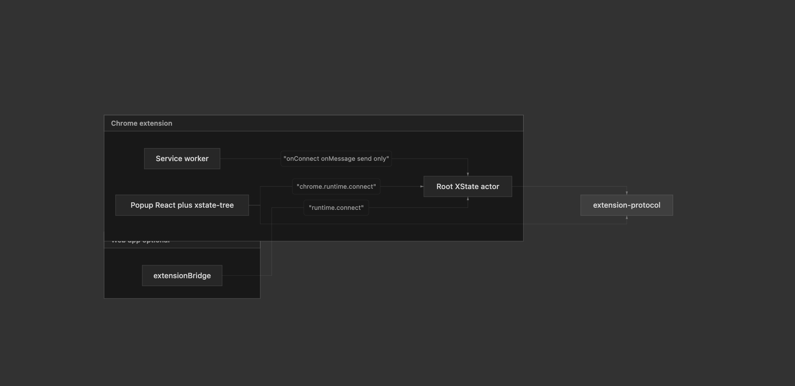

# 23-4-26

1. Read the plan that mahesh sir give us.


 
2. Implemted the external communication in chrom extension
```
	if (onConnectExternalRef && typeof onConnectExternalRef === 'object') {
		const addExternalListener = Reflect.get(onConnectExternalRef, 'addListener')
		console.log("external ref")
		if (typeof addExternalListener === 'function') {
			addExternalListener.call(onConnectExternalRef, (port) => {
				attachPortListeners(port, actor, '')
			})
		}
	}
```