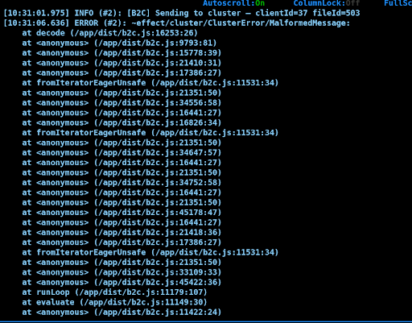

# 6-6-26

1. added Write pod execution on the execution happen on main daiwise execution 


*  give RBAC contorl to daywise worker to create a pod as soon as the daywise excution done

```

const spawnB2CJob = (params: { clientId: number; fileId: number }) =>
  Effect.tryPromise({
    try: async () => {
      const token     = fs.readFileSync("/var/run/secrets/kubernetes.io/serviceaccount/token", "utf8");
      const namespace = process.env["K8S_NAMESPACE"] ?? "default";
      const jobName   = `b2c-workflow-${params.clientId}-${Date.now()}`;
      const apiServer = "https://kubernetes.default.svc";

      const body = {
        apiVersion: "batch/v1",
        kind: "Job",
        metadata: { name: jobName, namespace },
        spec: {
          backoffLimit: 0,
          ttlSecondsAfterFinished: 600,
          template: {
            spec: {
              restartPolicy: "Never",
              serviceAccountName: "workflow-worker",
              containers: [{
                name: "b2c-workflow",
                image: "workflowdeepecom.azurecr.io/amazon_b2c:V0.2",
                
                env: [
                  { name: "CLIENT_ID",          value: String(params.clientId) },
                  { name: "FILE_ID",             value: String(params.fileId) },
                  { name: "SHARD_MANAGER_HOST",  value: "shard-manager-svc" },
                  { name: "SHARD_MANAGER_PORT",  value: "8080" },
                  { name: "DB_HOST",             value: "postgres" },
                  { name: "DB_USER",             value: "effect" },
                  { name: "DB_PORT",             value: "5432" },
                  { name: "DB_DATABASE",         value: "effect" },
                  { name: "DB_PASSWORD",         value: "effect" },
                  {
                    name: "GOOGLE_CHAT_WEBHOOK",
                    valueFrom: { secretKeyRef: { name: "google-chat-webhook", key: "GOOGLE_CHAT_WEBHOOK" } },
                  },
                ],
              }],
            },
          },
        },
      };
```

* Solve this messge runner layer conflict
