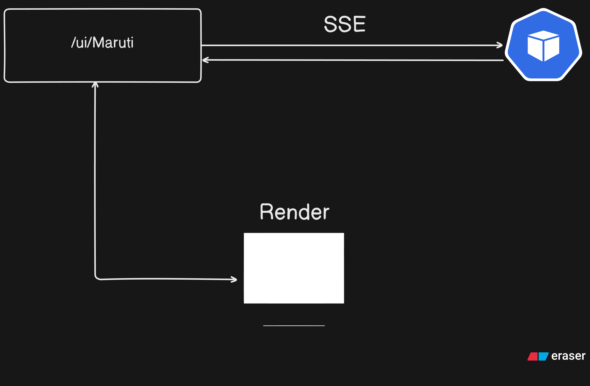

# 7-5-26

1. [ ] **Implement Basic of maruti**
2. [ ] **change the TestRunner to HttpRunner**
--- 
* [ ] **Implement Basic of maruti**
    * [x] Added route and auth in maruti route
    * [ ] after auth completed How we can share event from server to client 
        
    * [x] listinsting on a getStream channel Using maruti