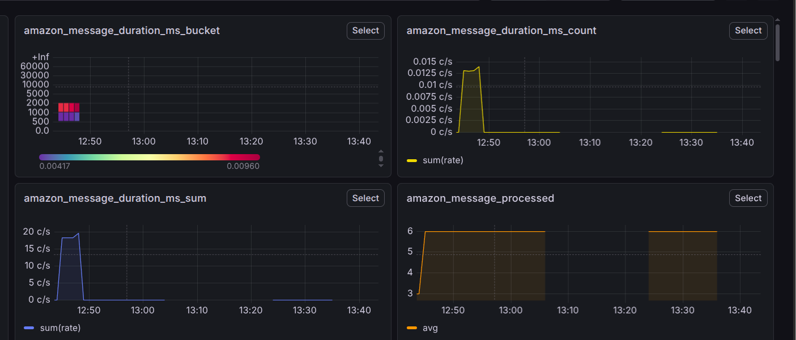
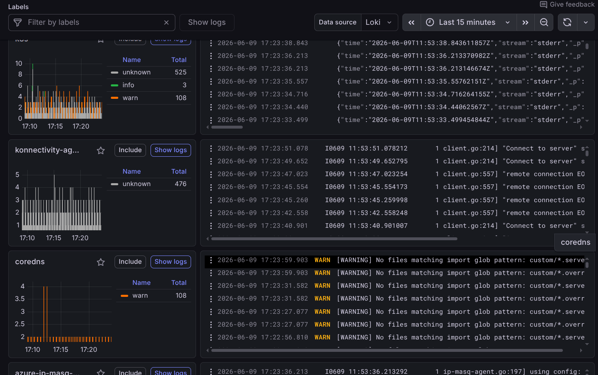

# 9-6-26

1. [x] **adding matrics to the grafana**
```
import { BunHttpClient } from "@effect/platform-bun";
import { Config, Effect, Layer, Option } from "effect";
import * as OtlpMetrics from "effect/unstable/observability/OtlpMetrics";
import * as OtlpTraces from "effect/unstable/observability/OtlpTracer";
import * as OtlpSerialization  from "effect/unstable/observability/OtlpSerialization";

export const OtelLayer = (serviceName: string) =>
Layer.unwrap(
Effect.map(
    Config.option(Config.string("OTEL_URL")).asEffect(),
    Option.match({
    onNone: () => {
        console.log("OTEL_URL not set. Telemetry is disabled.");
        return Layer.empty;
    },
    onSome: (url) => {
        console.log(` OTEL_URL=${url}`);
        

        const telemetryLayer = Layer.mergeAll(
        OtlpMetrics.layer({
            url: `${url}/v1/metrics`,
            resource: { serviceName },
            exportInterval: "15 seconds",
            temporality: "cumulative",
        }),
        OtlpTraces.layer({
            url: `${url}/v1/traces`,
            resource: { serviceName },
        })
        );

        // Provide the required dependencies (JSON serialization and Bun HTTP)
        return telemetryLayer.pipe(
        Layer.provide(OtlpSerialization.layerJson),
        Layer.provide(BunHttpClient.layer)
        );
    },
    })
)
);
```



2. [x] **Configure the grafana alert**

```
apiVersion: apps/v1
kind: Deployment
metadata:
  name: otel-lgtm
  namespace: monitoring
spec:
  replicas: 1
  selector:
    matchLabels:
      app: otel-lgtm
  template:
    metadata:
      labels:
        app: otel-lgtm
    spec:
      containers:
        - name: otel-lgtm
          image: docker.io/grafana/otel-lgtm:latest
          ports:
            - containerPort: 3000
            - containerPort: 4317
            - containerPort: 4318

          resources:
            limits:
              cpu: "2000m"
              memory: "4Gi"
            requests:
              cpu: "500m"
              memory: "1Gi"
```

3. [x] **Implemented lock logs for every pods**

```
apiVersion: v1
kind: Service
metadata:
  name: otel-lgtm-service
  namespace: monitoring
spec:
  type: LoadBalancer
  selector:
    app: otel-lgtm
  ports:
    - name: grafana
      port: 80
      targetPort: 3000
    - name: otlp-grpc
      port: 4317
      targetPort: 4317
    - name: otlp-http
      port: 4318
      targetPort: 4318
    - name: loki
      port: 3100
    - name: prometheus
      port: 9090
      targetPort: 9090
```