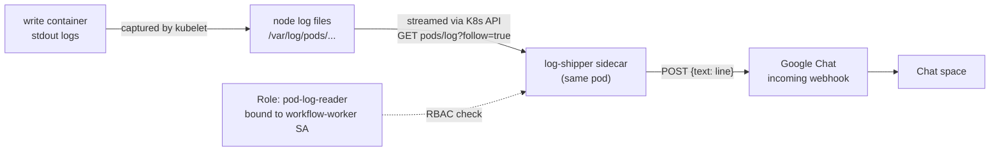

# Log Shipper: `write` pod → Google Chat

Sidecar in the `write` StatefulSet pod that streams the `write` container's logs via the Kubernetes API and forwards every line to a Google Chat webhook. No changes to the `worker_write` image needed.

## How it works



1. `write` logs to stdout like normal — untouched.
2. Kubelet captures stdout/stderr to the node's log files, same place `kubectl logs` reads from.
3. `log-shipper` (sidecar, same pod) calls the K8s API server directly: `GET /api/v1/namespaces/<ns>/pods/<pod>/log?container=write&follow=true`, authenticating with its own pod's service account token.
4. The API server checks RBAC before allowing the stream — this is why the Role/RoleBinding exists.
5. Each line that comes back is JSON-escaped and POSTed to the Google Chat webhook URL.
6. Google Chat renders it in the target space.

## Components

- **Role + RoleBinding** — grants `get` on `pods`/`pods/log` to the `workflow-worker` service account (the one the `write` StatefulSet already uses).
- **Secret `gchat-webhook`** — holds the webhook URL. Never put this in a plain env var.
- **ConfigMap `log-shipper-script`** — the `ship.sh` script the sidecar runs.
- **Sidecar container `log-shipper`** — added to the existing `write` pod spec, mounts the script, runs it.

## Step-by-step setup

### 1. Create the Google Chat webhook
In the target space: **⋮ menu → Apps & integrations → Manage webhooks → Add webhook**. Copy the URL it generates.

### 2. Apply RBAC
```bash
kubectl apply -f rbac.yaml
```

### 3. Create the secret
```bash
kubectl create secret generic gchat-webhook \
  --from-literal=url='<paste webhook URL here>'
```

### 4. Apply the ConfigMap
```bash
kubectl apply -f log-shipper-configmap.yaml
```

### 5. Update the StatefulSet
Add the `log-shipper` container + volume to `write`'s pod spec (full manifest in appendix), then:
```bash
kubectl apply -f write-statefulset.yaml
kubectl rollout restart statefulset write
```

### 6. Verify
```bash
kubectl get pods                          # write-0 should show 2/2 ready
kubectl logs write-0 -c log-shipper        # check it connected to the API ok
kubectl logs write-0 -c write              # trigger a log line in write
```
Confirm the line shows up in the Chat space within a couple seconds.

### 7. Tune (only if needed)
- Per-line sends will hit the webhook's rate limit if `write` is chatty — watch for `429` responses in `log-shipper`'s logs.
- If that happens, switch to batching (collect lines for N seconds, send one message) instead of one POST per line.

## Appendix: full manifests

**rbac.yaml**
```yaml
apiVersion: rbac.authorization.k8s.io/v1
kind: Role
metadata:
  name: pod-log-reader
rules:
  - apiGroups: [""]
    resources: ["pods", "pods/log"]
    verbs: ["get"]
---
apiVersion: rbac.authorization.k8s.io/v1
kind: RoleBinding
metadata:
  name: workflow-worker-pod-log-reader
subjects:
  - kind: ServiceAccount
    name: workflow-worker
roleRef:
  kind: Role
  name: pod-log-reader
  apiGroup: rbac.authorization.k8s.io
```

**log-shipper-configmap.yaml**
```yaml
apiVersion: v1
kind: ConfigMap
metadata:
  name: log-shipper-script
data:
  ship.sh: |
    #!/bin/sh
    set -eu
    TOKEN=$(cat /var/run/secrets/kubernetes.io/serviceaccount/token)
    CACERT=/var/run/secrets/kubernetes.io/serviceaccount/ca.crt
    API="https://kubernetes.default.svc"
    FILTER="${LOG_FILTER:-complete}"

    escape_json() { printf '%s' "$1" | sed -e 's/\\/\\\\/g' -e 's/"/\\"/g'; }
    send() { curl -s -X POST -H "Content-Type: application/json" \
              -d "{\"text\":\"$(escape_json "$1")\"}" "$GCHAT_WEBHOOK_URL" >/dev/null; }

    curl -sN --cacert "$CACERT" -H "Authorization: Bearer $TOKEN" \
      "$API/api/v1/namespaces/$POD_NAMESPACE/pods/$POD_NAME/log?container=write&follow=true" \
      | grep --line-buffered -i "$FILTER" \
      | while IFS= read -r line; do
          send "[$POD_NAME] $line"
          sleep 0.3
        done
```

**Sidecar block to add into `write`'s StatefulSet pod spec** (alongside the existing `write` container, not replacing it):
```yaml
        - name: log-shipper
          image: alpine:3.20
          command: ["/bin/sh", "-c"]
          args: ["apk add --no-cache curl >/dev/null 2>&1 && sh /scripts/ship.sh"]
          env:
            - name: POD_NAME
              valueFrom: { fieldRef: { fieldPath: metadata.name } }
            - name: POD_NAMESPACE
              valueFrom: { fieldRef: { fieldPath: metadata.namespace } }
            - name: GCHAT_WEBHOOK_URL
              valueFrom: { secretKeyRef: { name: gchat-webhook, key: url } }
          volumeMounts:
            - name: log-shipper-script
              mountPath: /scripts
          resources:
            requests: { cpu: 10m, memory: 32Mi }
            limits: { cpu: 50m, memory: 64Mi }
```

And add this under `spec.template.spec.volumes`:
```yaml
      volumes:
        - name: log-shipper-script
          configMap: { name: log-shipper-script, defaultMode: 0755 }
```

**Note:** the `apk add` at container start needs egress to Alpine's CDN. If AKS network policy blocks general internet egress, build a tiny custom image with `curl` baked in and push it to `workflowdeepecom.azurecr.io` instead, then swap the `image:` field.