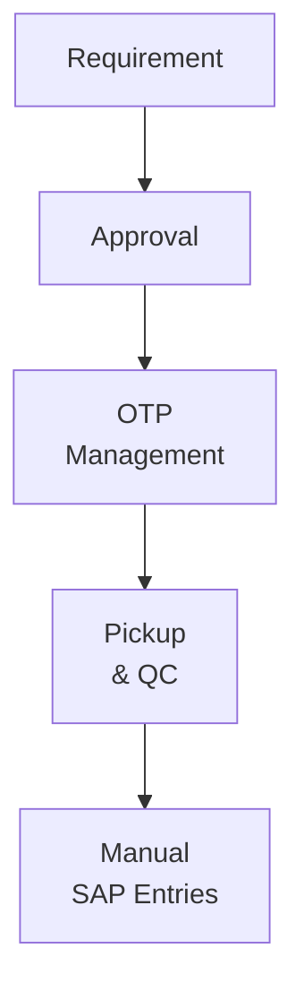

### DeepEcom Proccurement manegement

## Current Problems

- Every procurement step is performed manually, resulting in slow and error-prone workflows.
- OTPs are tracked manually using Google Sheets, making them difficult to manage and audit.
- Multiple Google Sheets are used across the process, leading to data duplication, inconsistency, and poor collaboration.
- SAP entries are created manually, increasing effort and increasing the risk of human error.
- There is no centralized system to track procurement activities from start to finish.
- Manual data transfer between systems causes delays and reduces operational efficiency.
- Tracking the status of procurement requests requires significant manual effort and lacks real-time visibility.
### Current Manual Procurement Process

> **Note:** Every step in the above workflow is performed manually, requiring human intervention. This results in delays, repetitive work, and a higher chance of errors.

# Queustion
1. how do we get data
2. How do we validate OTP